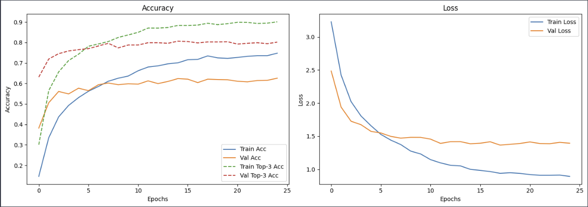
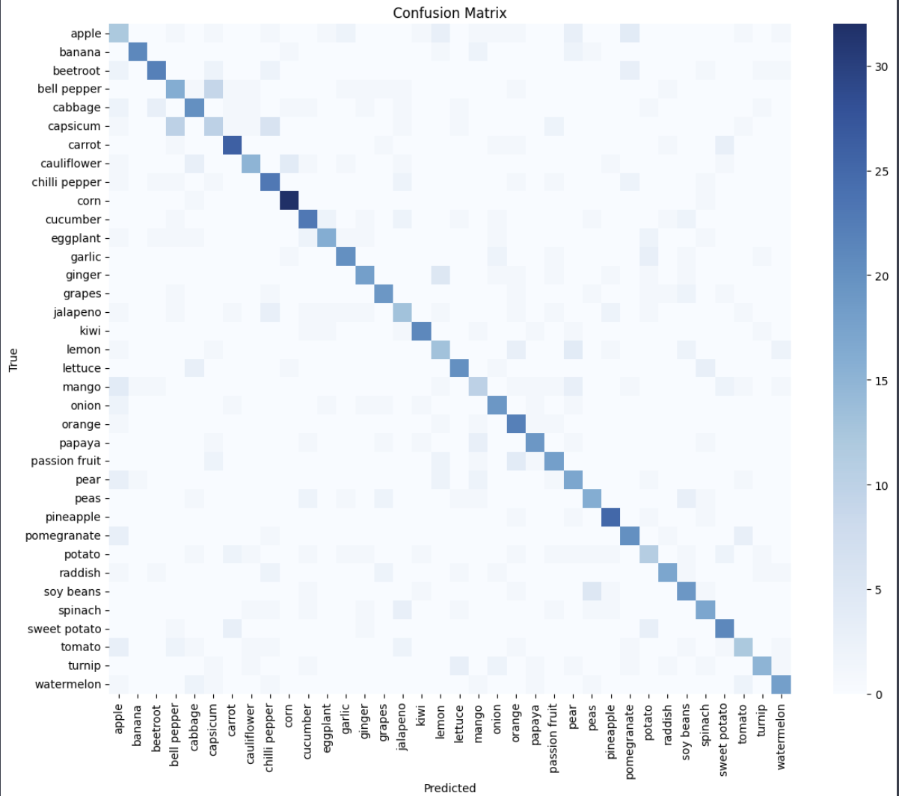

# 🍽️ Food Image Classification

This project applies **Convolutional Neural Networks (CNNs)** and **transfer learning** to classify food and vegetable images.  
It was designed as a hands-on computer vision project to practice data collection, preprocessing, model training, and evaluation.

---

## 🎯 Objectives
- Build a food image classifier using CNNs and transfer learning  
- Practice end-to-end CV workflow: data crawling, preprocessing, augmentation, training, evaluation  
- Understand the challenges of multi-class classification with real-world image data  

---

## 📂 Dataset
- **Source**: Collected via Google Image crawling (for educational and non-commercial use)  
- **Categories**: Fruits and vegetables (~50 classes)  
- **Availability**: Raw images are **excluded from the repository** to avoid copyright issues  

> ⚠️ All images are collected for **educational purposes only**.  
> If you want to build a similar dataset, use the crawling notebook in `notebooks/01_food-image-crawling.ipynb`.

---

## 🧠 Methods
- **Modeling**:  
  - Baseline CNN  
  - Transfer learning with MobileNetV2 (ImageNet pretrained)  
- **Training setup**:  
  - Optimizer: Adam  
  - Learning rate scheduler, EarlyStopping, ModelCheckpoint  
  - Epochs: 30  
- **Data Augmentation**: Resizing, normalization, random flips/rotations  

---

## 📊 Results

### Training Curves


### Confusion Matrix


### Evaluation Report


- **Validation Accuracy**: ~61% (Top-1)  
- **Top-3 Accuracy**: ~80%+  
- **Best classes**: banana, kiwi, pineapple (F1 > 0.8)  
- **Challenging classes**: apple, capsicum, corn  

---

## 🧱 Project Structure

```bash

food-image-classification/
├── figures/                          # Evaluation plots & confusion matrix
├── images/                           # Crawled dataset (excluded in .gitignore)
├── notebooks/                        # Experiment notebooks
│   ├── 01_food-image-crawling.ipynb        # Image crawler with Selenium
│   └── 02_food-image-classification.ipynb  # Model training & evaluation
├── best_model.h5                     # Trained model weights (excluded in .gitignore)
├── .gitignore
└── README.md

```

## 🚫 Limitations
- Dataset imbalance — some classes contain far fewer images than others  
- Visual similarity between certain categories (e.g., cabbage vs lettuce, capsicum vs chili pepper) reduces classification accuracy  
- Crawled images include noise (low quality, mislabeled, duplicates) which affects model generalization  
- Achieved validation accuracy (~61%) is modest and not yet sufficient for production-level use  

---

## 🔭 Next Steps
- Experiment with more advanced architectures (EfficientNet, Vision Transformers)  
- Apply stronger augmentation strategies (CutMix, Mixup, AutoAugment)  
- Investigate explainability tools (Grad-CAM, SHAP) to understand model decisions  
- Deploy a lightweight demo app with Streamlit or Flask for interactive testing  

---

## 👤 Author
Maintained by [hojjang98](https://github.com/hojjang98)  
📅 Last updated: September 2025
