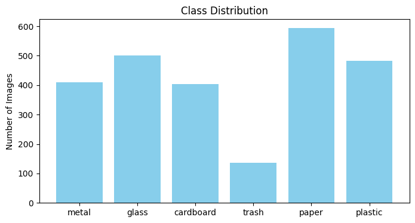
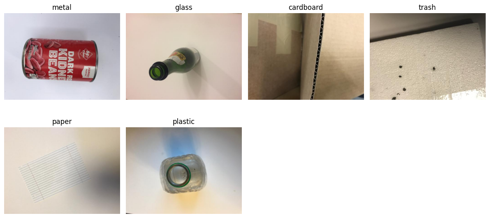
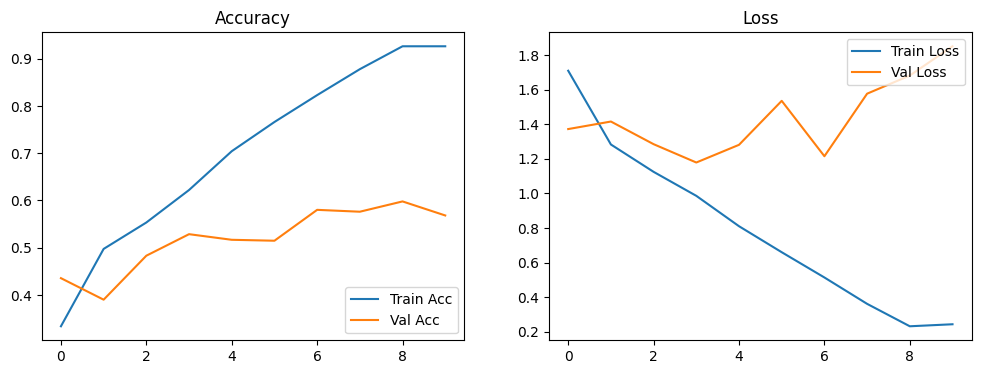
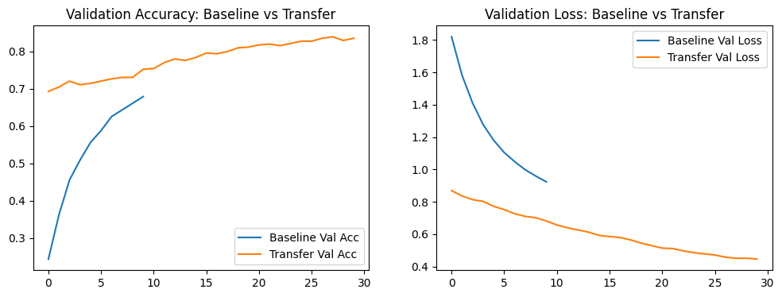
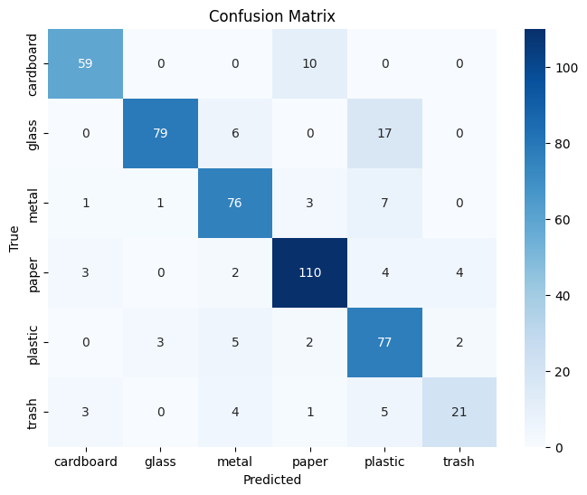

# 🗑️ Garbage Classification

> **A Computer Vision Project for Multi-Class Waste Image Classification**  
> Build and evaluate deep learning models to automatically identify categories of garbage images.

---

## 🎯 Objectives
- Explore and preprocess a garbage image dataset (6 categories)  
- Train a **baseline CNN** model for comparison  
- Apply **transfer learning with MobileNetV2** and fine-tuning  
- Analyze performance with metrics and confusion matrix  
- Deploy a **Streamlit demo** for real-time classification via webcam  

---

## 🧠 Methods
- **Dataset**: Garbage classification dataset (cardboard, glass, metal, paper, plastic, trash)  
- **Baseline Model**: Simple CNN (Conv → Pool → FC)  
- **Transfer Learning**: MobileNetV2 (feature extraction + fine-tuning, input size 224×224)  
- **Evaluation**: Accuracy, F1-score, confusion matrix, classification report  
- **Deployment**: Streamlit app (`app_webcam.py`) with webcam input  

---

## 📂 Dataset
This project uses the **Garbage Classification Dataset** from Kaggle:  
[Garbage Classification – Kaggle](https://www.kaggle.com/datasets/asdasdasasdas/garbage-classification)

- **Categories**: cardboard, glass, metal, paper, plastic, trash  
- **Images**: ~2,500+ labeled samples  
- **Format**: RGB images, varying sizes, organized in folders by class  

During preprocessing:
- Images were resized to **224×224**  
- Training/validation split of **80/20** was applied  
- Data augmentation (flip, rotation, zoom, contrast) was used to improve generalization  

---


## 📊 Results
| Model                 | Input Size | Val Accuracy |
|-----------------------|------------|--------------|
| Baseline CNN          | 128×128    | ~60%         |
| MobileNetV2 (frozen)  | 128×128    | ~78%         |
| MobileNetV2 (FT 40)   | 224×224    | ~84%         |

---


## 📊 Dataset



## 🚀 Baseline CNN


## 🔄 Transfer Learning vs Baseline


## 📉 Confusion Matrix (MobileNetV2)


---

**Confusion Matrix Highlights**  
- Paper, metal, cardboard classified with high accuracy (>85%)  
- Plastic ↔ Glass confusion observed  
- Trash class remains weakest (recall ~62%)  

---

## 📂 Project Structure

```bash

garbage-classification/
├── garbage_classification.ipynb # Main notebook: EDA, training, evaluation
├── garbage_classifier.h5 # Trained MobileNetV2 model
├── app_webcam.py # Streamlit webcam demo
├── outputs/ # Saved figures (confusion matrix, curves)
├── README.md # Project documentation
├── requirements.txt


```

---

## 🚫 Limitations
- Dataset size is small and **class imbalance** exists (trash under-represented)  
- **Plastic vs Glass** often confused due to visual similarity  
- **Domain gap**: real-time webcam input less reliable than validation dataset  
- MobileNetV2 relies heavily on **texture & color cues**, less robust to shape/lighting differences  

---

## 🔭 Next Steps
- Stronger **data augmentation** (brightness, contrast, random crop)  
- **Background removal** for webcam input  
- Test more **shape-aware architectures** (EfficientNetV2, Vision Transformer)  
- Domain adaptation with **webcam-collected samples**  

---

## 🚀 How to Run

### 1. Run the Notebook (Model Training & Evaluation)

``` bash

jupyter notebook garbage_classification.ipynb

This notebook includes:
- Dataset exploration & preprocessing  
- Baseline CNN training  
- Transfer learning with MobileNetV2 (fine-tuning)  
- Evaluation (confusion matrix, classification report)  

```

---


### 2. Run the Streamlit Demo (Webcam Classification)

``` bash

pip install -r requirements.txt
streamlit run app_webcam.py


- Ensure `garbage_classifier.h5` (trained model) is located in the same directory  
- Open your browser at [http://localhost:8501](http://localhost:8501) to test webcam classification  

```

## 👤 Author
Maintained by [hojjang98](https://github.com/hojjang98)  
📅 Last updated: September 2025


